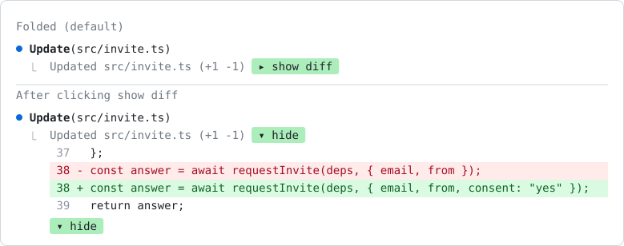

# T-mods

My mods for [Claude Code](https://claude.com/claude-code). A mod is a Claude Code plugin made of function hooks: a TypeScript module that can redraw parts of the terminal, add slash commands, or act on tool calls.

<picture>
  <source media="(prefers-color-scheme: dark)" srcset="fold-edits/docs/fold-edits-dark.svg">
  
</picture>

## Mods

| Mod | What it does |
| --- | --- |
| [fold-edits](fold-edits/) | Folds every Edit and Write diff, and the diff under a shell command that changed files, into one line, with a green button that opens the diff. |

## Install

Clone the repo to `~/.claude/mods`:

```sh
git clone https://github.com/Tatendaz/T-mods.git ~/.claude/mods
```

Then list each mod folder in the `env` block of `~/.claude/settings.json`. Separate folders with `:`.

```json
"env": {
  "CLAUDE_CODE_PLUGIN_DIRS": "~/.claude/mods/fold-edits"
}
```

New sessions load every listed mod. Saving a file in a listed folder reloads that mod in a running session.

To try one mod for a single session:

```sh
claude --plugin-dir ~/.claude/mods/fold-edits
```

## Add a mod

1. Build it with the `plugin-authoring` skill. The skill writes it to a scratch folder for the session.
2. Move the folder to `~/.claude/mods/<name>/`.
3. Add `~/.claude/mods/<name>` to `CLAUDE_CODE_PLUGIN_DIRS`.
4. Write `<name>/README.md` and add a row to the table above.
5. Run `scripts/check.sh`. It fails when a mod does not validate, has no passing tests, is missing from this README, or is missing from `CLAUDE_CODE_PLUGIN_DIRS`.
6. Commit to `main` and push.

## Layout

```
<mod>/
  .claude-plugin/plugin.json   manifest
  hooks/hooks.json             names the hooks module
  hooks/register.tsx           the hooks
  types/index.d.ts             state contract, when the mod keeps state
  tests/*.test.tsx             run by `claude plugin test <mod>`
  README.md
```

Claude Code writes `.claude-plugin/types/` the first time it loads a mod. Git ignores that folder.

The plugin API is early access, and it can change between Claude Code releases. These mods were last checked on Claude Code 2.1.288.
